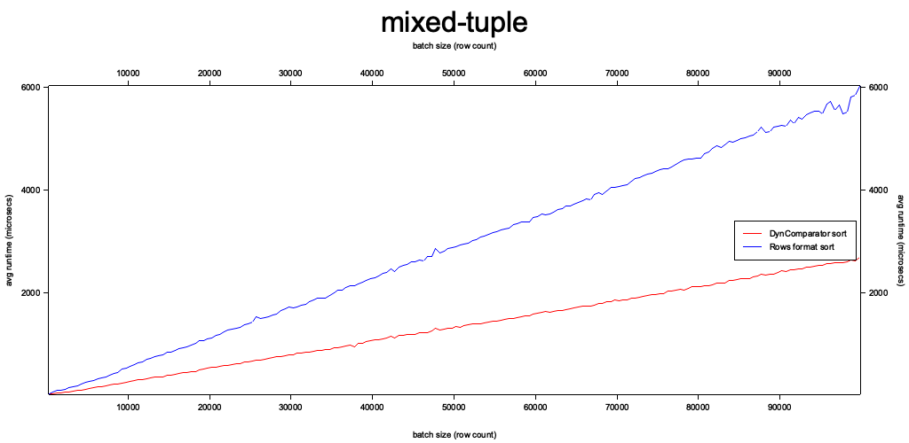
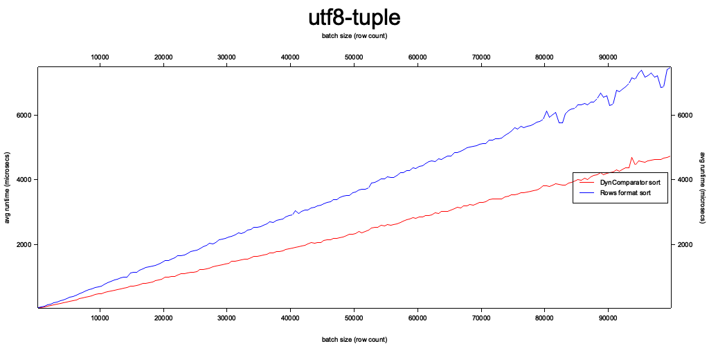
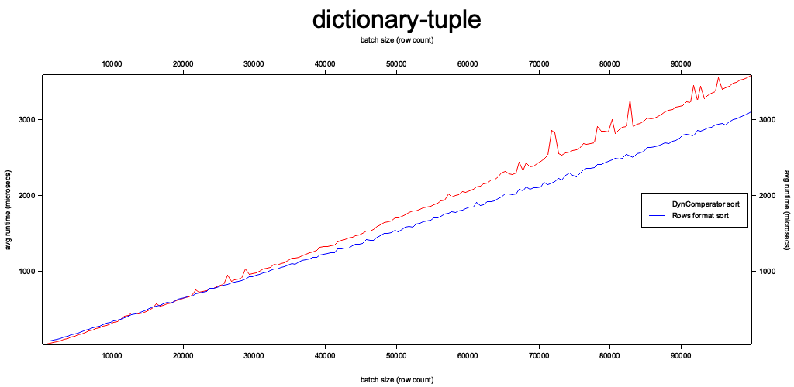
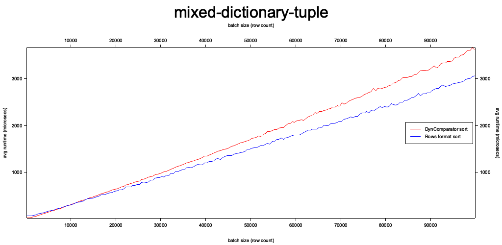

# Single batch, multi col sorting perf

In proposed SortExec changes (https://github.com/apache/arrow-datafusion/pull/5292), currently
seeing negative performance impacts when sorting by single record batches (when multiple
batches are sorted together, we are seeing the expected performance improvements).

This code lifts the `sort_batch` method from `SortExec` and runs various batch types
(e.g. "mixed-tuple") and sizes to examine the impact of batch size and workload type
on the two sort methods: DynComparator (main), and using the rows format (proposed).

The code then generates the following graphs comparing the sort methods
runtimes as batch size increaes (each workload type in a separate graph).









### Usage

New graphs can be created using cli:

```text
> cargo run --release -- --help
Usage: bench-arrow-sort [OPTIONS] --step-size <STEP_SIZE> --begin <BEGIN> --end <END>

Options:
  -c, --case <CASE>            [default: mixed-tuple] [possible values: utf8-tuple, mixed-tuple, dictionary-tuple, mixed-dictionary-tuple]
  -s, --step-size <STEP_SIZE>  how many rows to increment batch size by every time
  -b, --begin <BEGIN>          how many rows to start with
  -e, --end <END>              end after we've tested batches with this number of rows
  -i, --iters <ITERS>          how many iterations to run. raise this to decrease variance [default: 50]
  -h, --help                   Print help
```
